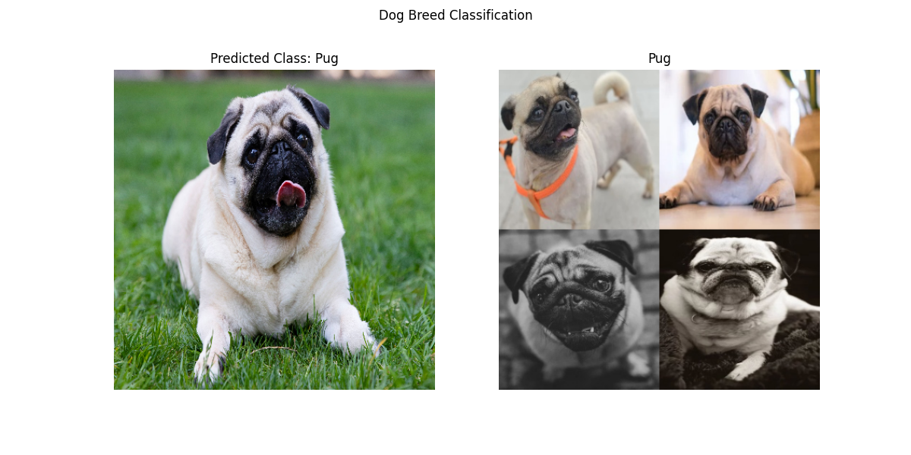

## DeepBark: Dog Breed Classification

---

-  Developed a deep learning model to accurately predict the breed of dogs, achieving an overall accuracy score of 96% across 70 different dog breeds.

- Employed image localization methods to visualize and interpret the specific areas in the images that influenced the model's predictions, providing insights into the decision-making process.

---


#### To run the script in your local machine, do the following:

1. Clone the repository from the [source code](https://github.com/alphiree/DeepBark-Dog-Breed-Classification). You can also clone the repository via git:

```
git clone https://github.com/alphiree/DeepBark-Dog-Breed-Classification.git
```

2. Run the script from your choice of IDEs or the terminal itself. You can run the script in the terminal by:

```
python main.py
```

> Note: Make sure you already have all the dependencies installed. The required packages can be seen in _deeplearning_functions.py_

3. Input the path of the image of the dog you want to be classified.
    
4. The results will be shown with the score on how confident the DeepBark is with its classification.
    

Example Result:



